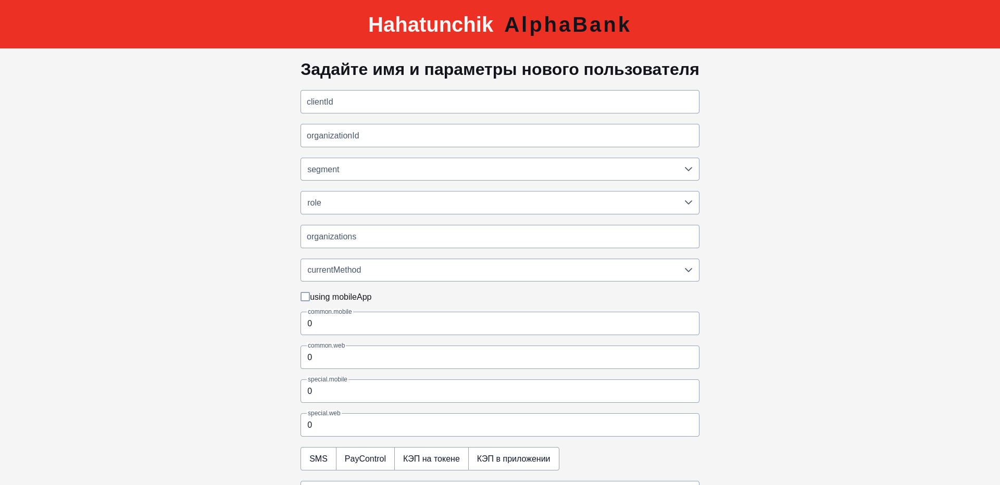
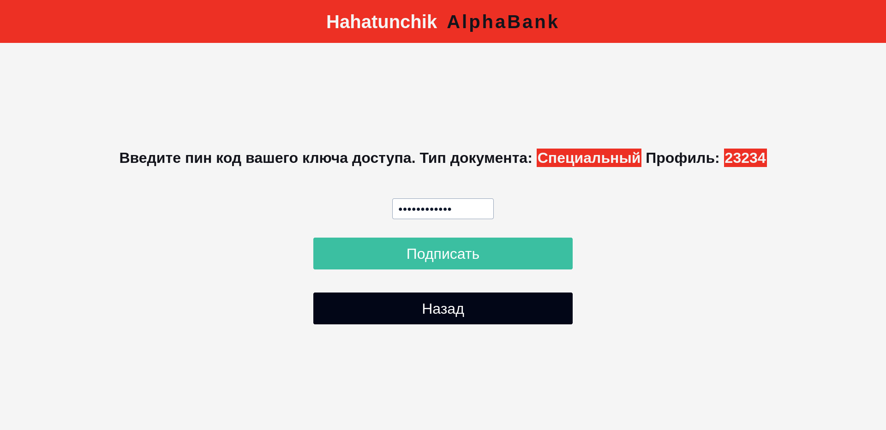

# hahatunchik_AlfaBank

Разработка рекомендательной системы выбора способа электронного подписания документов от Альфа-Банка

## Задача
Разработать MVP (клиент-серверное) приложение, которое будет по заданным параметрам пользователя выдавать рекомендуемый способ подписания документа

## Клиент
Клиент написан на *Vue3* с использованием системы сборки *Vite*. Для улучшения внешнего вида использовались компоненты из *primevue*. Основной функционал: настройка пользователя, выбор типа документа, выбор типа подписи и сам процесс подписи (эмуляция)

## Сервер
Сервер написан на *spring* и реализует нужное API, формат передачи данных -- JSON в теле POST запросов. Внутри сервер общается с нейронной сетью, чтобы подобрать необходимый тип подписи

## Выбор подписи
Выбор подписи, как того требует задание, выполняется с помощью предобученной модели. Данные для обучения составлялись вручную/генерировались

## Демонстрация

